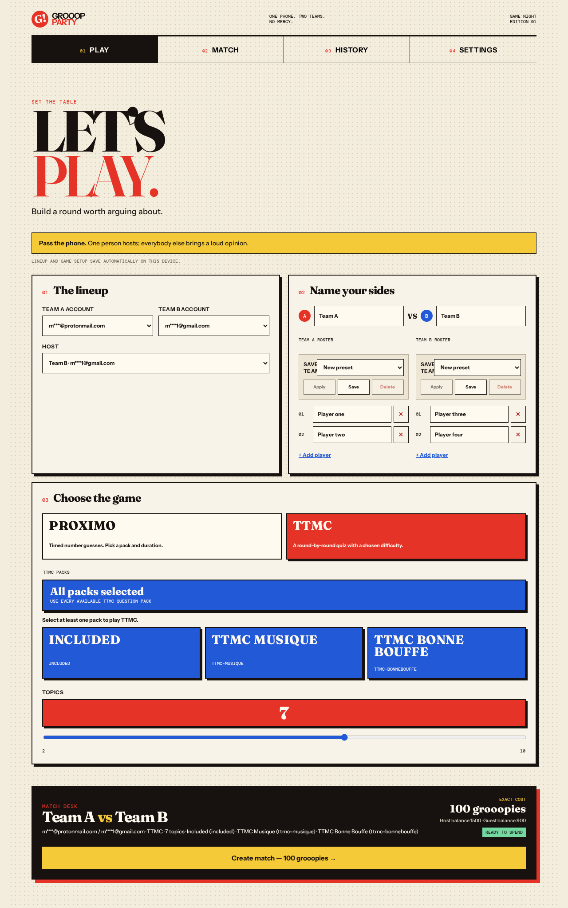
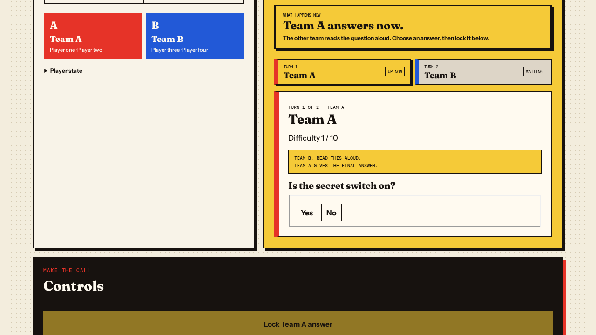
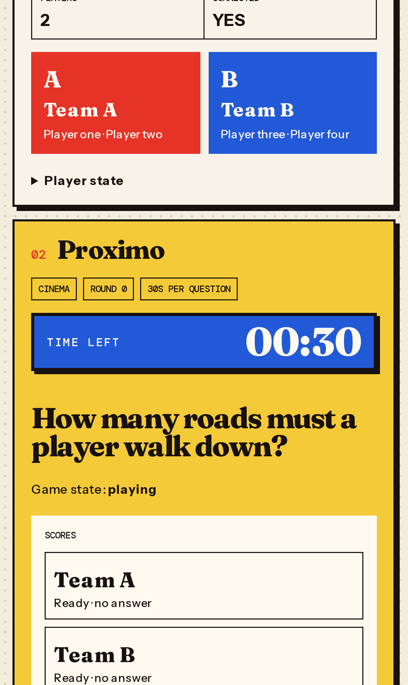
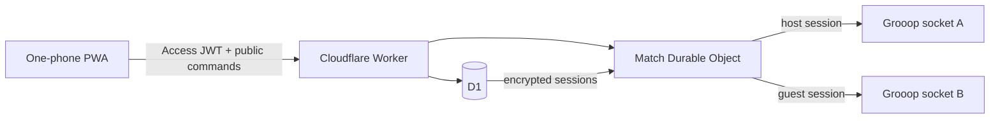

<div align="center">
  
  <h1>Grooop Client</h1>
  <p><strong>One phone. Two teams. No mercy.</strong></p>
  <p>A private game-night desk for running Proximo and TTMC with two Grooop accounts.</p>
  <p>
    <a href="https://github.com/mirsella/grooop-client/actions/workflows/ci.yml"></a>
    
    
    
  </p>
</div>

<p align="center">
  
</p>
<p align="center"><sub>Build the teams, choose the game, get the exact price, and start from one screen.</sub></p>

## What it does

Grooop Client turns one phone into a control desk for two local teams. It keeps both Grooop identities on the server, joins them to the same paid party, and gives the person holding the phone a clear next action throughout the match.

| | |
|---|---|
| **Proximo** | Timed number questions, private answer lock-in for each team, an authoritative reveal, and another question without creating another party. |
| **TTMC** | Two ordered team turns per topic, difficulty choices from 1 to 10, five original question formats, scoring, and alternating first team. |
| **One-phone flow** | Saved lineups, team presets, automatic pricing, live reconnection, match restoration, history, and cancellation. |
| **Private by design** | Grooop sessions stay encrypted in D1. The browser receives masked identities and sanitized match state only. |

## The live desk

<table>
  <tr>
    <td width="67%">
      
    </td>
    <td width="33%">
      
    </td>
  </tr>
  <tr>
    <td align="center"><sub>TTMC makes the handoff explicit: who answers, who reads, and who waits.</sub></td>
    <td align="center"><sub>Proximo keeps the question clock visible on mobile.</sub></td>
  </tr>
</table>

The visual language is intentionally loud: newsprint, primary colors, hard borders, oversized type. It should feel like something on the table during game night, not an admin dashboard.

## Why the Worker exists

The browser never sees a Grooop session token or party code. A Cloudflare Worker owns authentication and paid match creation. A Durable Object owns the two upstream party sockets and serializes every live mutation.



- React 19 and Vite serve an installable responsive PWA.
- Cloudflare Access protects every static and API request. The Worker verifies the JWT again.
- D1 stores encrypted account material, match records, presets, challenges, and observed questions.
- One Durable Object per match owns synchronization, deadlines, mutation markers, reconnects, and the terminal snapshot.
- The service worker caches the application shell but never caches `/api/` responses.

## Run it locally

Requirements: Node.js, pnpm 11, and a Cloudflare account.

```bash
pnpm install
pnpm exec wrangler d1 migrations apply grooop-party-pwa --local
pnpm dev:worker
```

The project intentionally denies Vite access to `.creds`, `.wrangler`, Git metadata, and environment files. Keep browser states, D1 exports, and Grooop credentials outside the repository.

## Test it

```bash
pnpm typecheck
pnpm lint
pnpm test
pnpm test:worker
pnpm build
pnpm test:e2e
```

The test stack covers the boundaries separately:

- Unit tests replay sanitized production traffic and exercise party sockets, shared state, Durable Object recovery, deadlines, terminal fencing, TTMC schemas, and mutation idempotency.
- Worker tests apply the real migration chain to local D1 and cover Access, encrypted accounts, quotes, paid creation, joining, cancellation, purchases, and concurrency.
- Playwright runs desktop Chrome plus Pixel 7 and iPhone 15 layouts. Its API and socket boundary is deterministic, so normal CI cannot spend Grooopies.
- Production tests are serial and opt-in. They require a manually authenticated Access browser state stored outside the repository with mode `0600`.

Read-only production check:

```bash
LIVE_BASE_URL=https://grooop-party-pwa.mirsella.workers.dev \
LIVE_STORAGE_STATE=/absolute/path/to/access-state.json \
  pnpm test:live
```

Paid production check, guarded by both an explicit flag and a hard price cap:

```bash
LIVE_BASE_URL=https://grooop-party-pwa.mirsella.workers.dev \
LIVE_STORAGE_STATE=/absolute/path/to/access-state.json \
LIVE_ALLOW_SPEND=1 LIVE_SPEND_CAP=100 \
  pnpm test:live
```

The app has also been exercised manually against paid production parties. Complete Proximo and TTMC games, follow-up questions, reconnects, finish projection, and cancellation have all been tested with real upstream state. Paid TTMC runs produced multiple-choice, numeric, one-word, and ordered-word questions; the boolean contract comes from a sanitized production capture and the original client schema.

## Deploy it

The production deployment is private behind Cloudflare Access:

```text
https://grooop-party-pwa.mirsella.workers.dev
```

`pnpm deploy` builds the PWA, applies pending remote D1 migrations, and deploys the Worker in that order.

```bash
pnpm deploy
```

Preview URLs are disabled. Production fails closed if the encryption key, key version, or Access configuration is missing. The authenticated health route also checks the current match schema.

## How matches stay safe

<details>
<summary><strong>Paid creation and recovery</strong></summary>

The browser prices every valid setup automatically. Creating the match still requires one explicit click on a button that includes the exact cost.

Before it calls Grooop's paid endpoint, the Worker claims a unique idempotency key and canonical request fingerprint in D1. A retry with the same request returns the existing match instead of creating another party. Party metadata is persisted before the guest joins, so a joining match can resume after a reload without repeating the paid call.

Grooop has no create idempotency key and no lookup by the client's request ID. If the paid request has an unknown transport outcome, the app records `party-create-outcome-unknown` and blocks another paid creation. It does not guess and risk charging twice.

</details>

<details>
<summary><strong>Proximo flow</strong></summary>

The room adds a Proximo game only after the upstream party is running. Once the new game appears in synchronized state, both controlled accounts become ready. A conservative question start timestamp is persisted before the ready mutations, so a Durable Object restart cannot grant a fresh timer.

Each team can lock a complete answer privately. The room submits account-specific answers and records per-player mutation markers. Official answers and score changes stay hidden until synchronized state sets `showAnswer: true`. Starting the next question adds another Proximo game to the same party.

</details>

<details>
<summary><strong>TTMC flow</strong></summary>

The host starts the first topic. Team A answers first on odd topics and Team B answers first on even topics. The Durable Object enforces this order, not just the interface.

Each team chooses its own difficulty and receives its own question for the shared topic. Supported formats match the original client: yes/no, multiple choice, ordered words, one-word text, and bounded numbers. Pending answers do not advance the other team. Only an accepted answer or authoritative played state does.

Raw correct answers stay in Durable Object storage. The browser receives the prompt and controls first, then the result after the whole topic is authoritatively finished.

</details>

<details>
<summary><strong>Cancellation and terminal state</strong></summary>

Grooop does not let the game master leave an IRL party, so cancellation uses the controlled guest's official `give-up` command. An empty waiting party is bootstrapped first because the upstream command rejects a guest leave before a game or round exists.

The room stores a sanitized terminal snapshot before projecting `finished` or `cancelled` to D1. Live D1 updates use guarded transitions and cannot overwrite a terminal row. If projection fails, a Durable Object alarm retries it without repeating the upstream action.

Natural completion waits for both sockets and complete mode-specific results. A partial final frame cannot freeze an incomplete score or answer into the terminal snapshot.

</details>

<details>
<summary><strong>Security boundaries</strong></summary>

Account email and session material use AES-256-GCM with random nonces. API responses are private and carry `Cache-Control: no-store`. Static responses include a frame-denying CSP, `X-Frame-Options: DENY`, no-sniff, no-referrer, and a restrictive Permissions Policy.

Same-origin checks protect mutations and browser WebSocket upgrades. The outer Worker checks Cloudflare Access before routing static files, APIs, or match sockets. Reauthentication updates are generation-aware, so a delayed rejection from an old session cannot invalidate a newer session.

</details>

## Project map

```text
src/                 React PWA and API client
worker/              Worker routes, Grooop boundary, and MatchRoom
migrations/          Ordered D1 schema migrations
tests/unit/          Protocol, crypto, reducer, and Durable Object tests
tests/worker/        Worker integration tests on local D1
tests/e2e/           Browser flows and responsive layouts
tests/live/          Explicitly guarded production checks
docs/screenshots/    Deterministic, credential-free README captures
```

Regenerate the README screenshots from mocked app state:

```bash
CAPTURE_README_SCREENSHOTS=1 pnpm exec playwright test \
  --project=desktop-chromium \
  --grep "selects TTMC packs|runs TTMC team turns"

CAPTURE_README_SCREENSHOTS=1 pnpm exec playwright test \
  --project=iphone-chromium \
  --grep "shows a prominent countdown"
```

## Known limits

- This is a private single-owner deployment, not a general hosted service.
- An unknown paid-create outcome requires operator reconciliation because retrying could charge again.
- There is no supported bulk question endpoint. The archive grows from questions observed during normal games.
- Deploying the Worker disconnects upstream sockets. Live rooms reconnect and perform a full synchronization.
- Account and match history currently prevent deleting referenced accounts.
- The production URL requires the configured Cloudflare Access identity.
